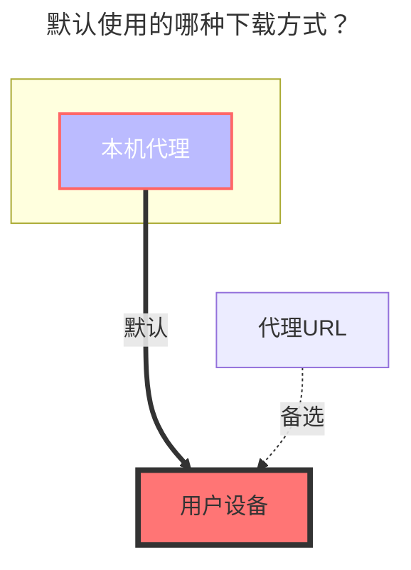

---
# This is the icon of the page
icon: iconfont icon-state
# This control sidebar order
order: 28
# A page can have multiple categories
category:
  - Guide
# A page can have multiple tags
tag:
  - Storage
  - Guide
  - "本地代理"
# this page is sticky in article list
sticky: true
# this page will appear in starred articles
star: true
---
# SMB

是把smb挂载到Alist，而不是Alist通过smb共享出来，而不是smb能像webdav共享出来。

因无相关设备和服务，无法测试，可以根据 **GitHub Discussions** 讨论中提供的办法自行测试一下

**https://github.com/alist-org/alist/discussions/2215#discussioncomment-4104018**

等待有了相关设备或服务后更详情的教程再进行补充，或者等待测试没问题的大佬pr。

### **默认使用的下载方式**

### **SMB挂载到Alist**

存储-驱动内添加驱动器，选择  SMB

注意! 正式挂载到alist之前先用windows挂载一遍，这样既能检查挂载设置是否正确又能更好理解下边教程的思路

假设nas的内网ip为  192.168.0.233  ，使用win+r执行  \\192.168.0.233   打开网络位置

成功后会弹出一个新的网络文件夹(就一个普通文件夹图标地下加一个管道一样的东西)

这个玩意就是smb的网络文件夹，这个文件夹名字抄下来，打开后会有之前你设置好的对应主机目录内的文件

然后在刚刚打开的alist-SMB配置网页最底下的   分享名称    项内填上你刚刚抄的文件夹名

接着填smb服务器的内网ip和账号密码，其他的不用填，最顶上的挂载路径随便填，那玩意是alist主页给你区分文件夹用的

一般情况下，这玩意会成功运行
